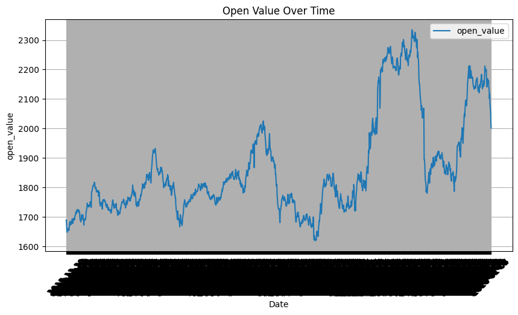
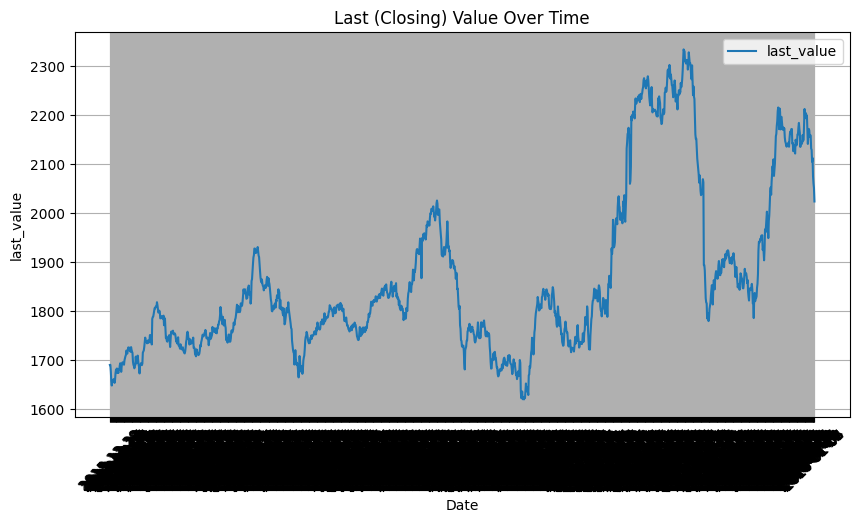
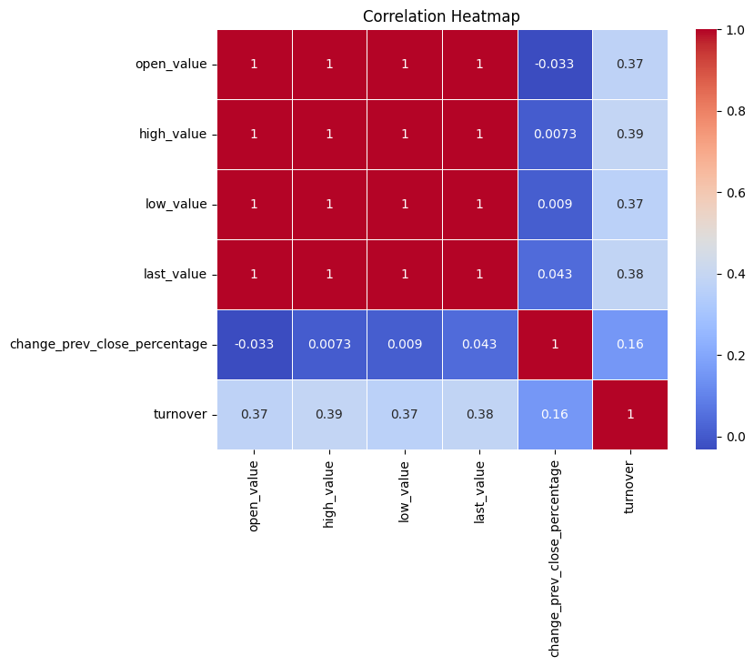
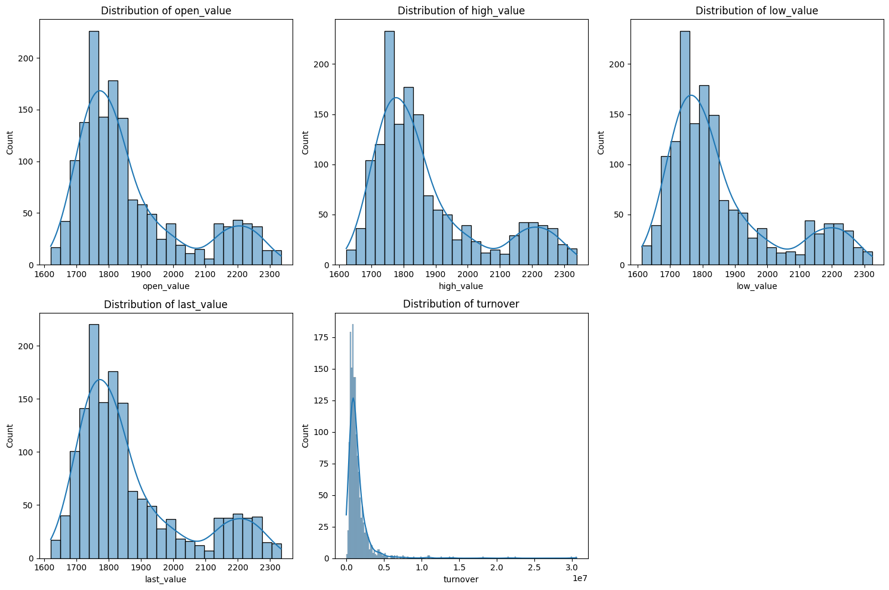
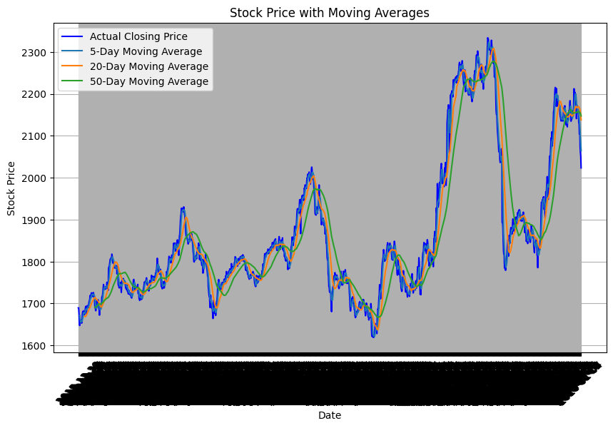

# Stock_prediction_using_LSTM
This project aims to predict the next day's closing price of a stock using historical stock data. The prediction model is built using a Long Short-Term Memory (LSTM) network, a type of recurrent neural network (RNN) particularly effective for time-series forecasting tasks.

## Table of Contents
- [Overview](#overview)
- [Features](#features)
- [Installation](#installation)
- [Usage](#usage)
- [Data Cleaning](#data-cleaning)
- [Data Preprocessing](#data-preprocessing)
- [Data Visualization](#data-visualization)
- [Model Building](#model-building)
- [Model Evaluation](#model-evaluation)
- [Streamlit Application](#streamlit-application)
- [Results](#results)
- [Conclusion](#conclusion)
- [Contributing](#contributing)
- [License](#license)

## Overview
The stock price prediction project is designed to forecast the next day's closing price based on historical data using machine learning techniques, specifically LSTM (Long Short-Term Memory) networks. The workflow of the project is divided into five main parts: data cleaning, data preprocessing, data visualization, model building, and model evaluation. Additionally, an interactive Streamlit app is provided for users to make predictions using their input data.

## Features
* **Data Cleaning:** Removal of missing values, duplicate rows, and handling of outliers.
* **Data Preprocessing:** Feature engineering, scaling, and transformation to prepare the data for training.
* **Data Visualization:** Exploratory data analysis using various plots to understand the data better.
* **LSTM Model for Time-Series Forecasting**: A neural network model designed to learn from sequential data and predict future stock prices.
* **Model Evaluation:** Assessing the model's performance using various metrics and visualizations.
* **Interactive Streamlit App:** Allows users to input stock data and receive real-time predictions.

## Installation
1. **Clone the repository:** 
* https://github.com/bikash-bhandari-chhetri/Stock_prediction_using_LSTM.git
* cd Stock_prediction_using_LSTM
3. **Install the required dependencies:**
pip install -r requirements.txt
4. **Ensure you have the following files in your project directory:**
* Stock_Prediction_using_LSTM(Data_Cleaning).ipynb: Jupyter notebook for data cleaning
* Stock_Prediction_using_LSTM(Data_Preprocessing).ipynb: Jupyter notebook for data preprocessing
* Stock_Prediction_using_LSTM(Data_Visualization).ipynb: Jupyter notebook for data visualization
* Stock_Prediction_using_LSTM(Model_Building_and_Training)ipynb.ipynb: Jupyter notebook for model building   and training
* Stock_Prediction_using_LSTM(Model_Evaluation_and_Prediction).ipynb: Jupyter notebook for model           
evaluation and prediction
* scaler.pkl: Scaler object for data normalization
* lstm_stock_price_model.keras: Trained LSTM model
* app.py: Streamlit app script
* stock_data.csv: Original dataset
* cleaned_stock_data.csv: Cleaned dataset
* preprocessed_stock_data.csv: Preprocessed dataset
* requirements.txt: txt file containing all the required dependencies

## Usage
**Running Notebooks**
Each Jupyter notebook handles a different stage of the project:
1. **Data Cleaning (Stock_Prediction_using_LSTM(Data_Cleaning).ipynb):** This notebook is responsible for preparing the raw dataset for further analysis. It involves:
* **Checking for Missing Values:** Identifying and handling missing data by imputation.
* **Removing Duplicates:** Identifying and removing duplicate rows to avoid data redundancy.
* **Handling Outliers:** Identifying outliers using statistical methods

2. **Data Preprocessing (Stock_Prediction_using_LSTM(Data_Preprocessing).ipynb):** This notebook performs the following tasks:
* **Date Feature Engineering:** Extracting year, month, and day from the date column to enhance the model's ability to learn from seasonal trends.
* **Scaling Features:** Normalizing the data using MinMaxScaler to ensure that all features are on the same scale, which is crucial for training neural networks.

3. **Data Visualization (Stock_Prediction_using_LSTM(Data_Visualization).ipynb):** This notebook provides various visualizations to understand the data better and identify any patterns or correlations. It includes:
* **Stock Price Trends:** Visualize the trends of stock prices (open, and closing prices) over time.
* **Correlation Heatmap:** Display a heatmap to show the correlation between different numerical features in the dataset.
* **Distribution Plots:** Visualize the distribution of key features such as open, high, low, last value, and turnover.
* **Moving Averages:** Plot moving averages to smooth out the price data and identify trends more clearly.

4. **Model Building and Training (Stock_Prediction_using_LSTM(Model_Building_and_Training)ipynb.ipynb):** This notebook is dedicated to building and training the LSTM model:
* **Data Preparation for LSTM:** Creating sequences of data points for training the LSTM model.
* **Model Architecture:** Defining the structure of the LSTM network, including input layers, hidden LSTM layers, and output layers.
* **Training the Model:** Compiling and fitting the model on the training data using the Adam optimizer and Mean Squared Error (MSE) loss function.

5. **Model Evaluation and Prediction (Stock_Prediction_using_LSTM(Model_Evaluation_and_Prediction).ipynb):** This notebook evaluates the performance of the trained model:
* **Predictions:** Using the model to predict the next day's price on the test dataset.
* **Performance Metrics:** Calculating Mean Squared Error (MSE) and other relevant metrics.
* **Visualizations:** Plotting the predicted vs. actual prices to visually assess the model's performance.

To run these notebooks, open them in Google Colab, Jupyter Notebook or Jupyter Lab and execute each cell sequentially.

## Data Cleaning
**Data cleaning** is the initial and most crucial step to ensure the quality of the dataset. The following tasks were performed:

* **Check for Missing Values:** We identified any missing values in the dataset. If missing values were found in numeric columns, they were imputed with the column's mean.
* **Check for Duplicates:** Duplicate rows in the dataset were checked and imputed to avoid redundant information.
* **Handle Outliers:** Outliers were identified using statistical methods such as the Interquartile Range (IQR).

## Data Preprocesing
**Data Preprocessing** transforms raw data into a format suitable for machine learning. Key tasks included:

* **Date Parsing and Feature Engineering:** The date column was split into separate year, month, and day columns to allow the model to learn from seasonal patterns.
* **Feature Scaling:** The MinMaxScaler was used to scale the features between 0 and 1 to improve model convergence during training.

## Data Visualization
**Data Visualization** helps understand the underlying patterns in the stock data and identify relationships between different variables. This notebook provides several visualizations:

* **Visualizing Stock Price Trends:** Shows how the stock prices (open and closing values) change over time.

* **Correlation Heatmap:** Displays correlations between numerical features, helping to understand which features might be more predictive.

* **Distribution Plots:** Plots the distribution of key features to identify skewness or unusual patterns in the data.

* **Moving Averages:** Helps to smooth out price data and highlight trends by plotting moving averages.

